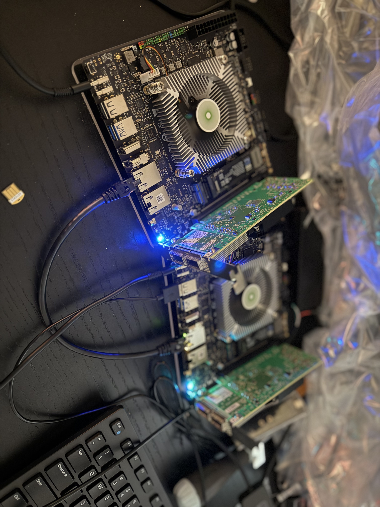

# Radxa Orion O6 + Mellanox CX5 Adapter

Explore RDMA connection with two Mellanox Connect-X 5 Adapters and two Radxa Orion O6 motherboard.    
Explore running Llama3, and Qwen 2.5 on the two nodes, with RDMA connections.

## Finished Setup




## Overview


*[Google Drawing Source](https://docs.google.com/drawings/d/1ZwIgaC7xvciscB6xi67RankqfdwDEHLDWSmZ_Fm2css/edit?usp=sharing)*

## Parts & Specs

* 2 x Radxa Orion O6 AI PC, [spec](https://radxa.com/products/orion/o6/)
* 2 x ConnectX-5 Adapter, [spec](https://network.nvidia.com/files/doc-2020/pb-connectx-5-en-card.pdf)
* 1 x QSFP DAC (Direct Attach Copper) cable
    * Example, 10Gtek 40G QSFP+ DAC Cable, [amazon option](https://a.co/d/0aWIE4tS)
* 2 x M.2 NVMe SSD as boot drives.
    * Example: SAMSUNG 990 EVO PLUS SSD 1TB, [newegg option](https://www.newegg.com/samsung-1tb-990-evo-plus-nvme-2-0/p/N82E16820147899?Item=N82E16820147899&_gl=1*9v7i07*_gcl_au*NzQ3MDQyMTQ3LjE3NzEyMTAwNTI.*_ga*MTIyOTk0NTU2Mi4xNzcxMjEwMDUy*_ga_TR46GG8HLR*czE3NzI5MzI2NTUkbzMkZzEkdDE3NzI5MzI3MjEkajU0JGwwJGgxMDE2OTk5MTM4)
* 1 x M.2 NVMe SSD Enclosure
    * Connecting M.2 SSD to your laptop, for installing OS.
    * Example, BUCIER Transparent M.2 NVMe SSD Enclosure, [newegg option](https://www.newegg.com/p/3C6-00RD-000V8?Item=9SIB2XHKM54013&_gl=1*udr8uc*_gcl_au*NzQ3MDQyMTQ3LjE3NzEyMTAwNTI.*_ga*MTIyOTk0NTU2Mi4xNzcxMjEwMDUy*_ga_TR46GG8HLR*czE3NzI5MzI2NTUkbzMkZzEkdDE3NzI5MzI3MTUkajYwJGwwJGgxMDE2OTk5MTM4)
* USB to TTL Serial Console cable
    * For serial console access to Radxa Orion O6 board.
    * Example, USB to TTL 5V 3.3V Serial Download Cable, [newerr option](https://www.newegg.com/p/3C6-00SS-00CB3?Item=9SIB3EWKN76438&_gl=1*1l31g4m*_gcl_au*NzQ3MDQyMTQ3LjE3NzEyMTAwNTI.*_ga*MTIyOTk0NTU2Mi4xNzcxMjEwMDUy*_ga_TR46GG8HLR*czE3NzI5MzI2NTUkbzMkZzEkdDE3NzI5MzI5MDMkajYwJGwwJGgxMDE2OTk5MTM4)

## Tips

### Partition the M.2 NVMe SSD on Mac.

`Disk Utility` GUI app on Mac appears to be buggy. So I turned to use command line equivalent, which works for me. For example, I simply partition my NVMe SSD to carve out a 200G GPT patition, and rest for another partition. I simply use the first partition as the boot partition for installing Ubuntu OS, or any OS you like using.

From your mac terminal, Run `diskutil list` to list all disks, and identify the disk name for the external NVMe SSD. In my case, that is `/dev/disk4`. So my cmd is,

```
$ diskutil partitionDisk /dev/disk4 2 GPT ExFAT "LinuxSystem" 200G ExFAT "LinuxData" R
```

Example output, in my case,

```
xuehaohu@Mac rdma-cookbook % diskutil partitionDisk /dev/disk4 2 GPT ExFAT "LinuxSystem" 200G ExFAT "LinuxData" R
Started partitioning on disk4
Unmounting disk
Creating the partition map
Waiting for partitions to activate
Formatting disk4s2 as ExFAT with name LinuxSystem
Volume name      : LinuxSystem
Partition offset : 411648 sectors (210763776 bytes)
Volume size      : 390623232 sectors (199999094784 bytes)
Bytes per sector : 512
Bytes per cluster: 131072
FAT offset       : 2048 sectors (1048576 bytes)
# FAT sectors    : 12288
Number of FATs   : 1
Cluster offset   : 14336 sectors (7340032 bytes)
# Clusters       : 1525816
Volume Serial #  : 69acea86
Bitmap start     : 2
Bitmap file size : 190727
Upcase start     : 4
Upcase file size : 5836
Root start       : 5
Mounting disk
Formatting disk4s3 as ExFAT with name LinuxData
Volume name      : LinuxData
Partition offset : 391034880 sectors (200209858560 bytes)
Volume size      : 1562488832 sectors (799994281984 bytes)
Bytes per sector : 512
Bytes per cluster: 131072
FAT offset       : 2048 sectors (1048576 bytes)
# FAT sectors    : 49152
Number of FATs   : 1
Cluster offset   : 51200 sectors (26214400 bytes)
# Clusters       : 6103272
Volume Serial #  : 69acea87
Bitmap start     : 2
Bitmap file size : 762909
Upcase start     : 8
Upcase file size : 5836
Root start       : 9
Mounting disk
Finished partitioning on disk4
/dev/disk4 (external, physical):
   #:                       TYPE NAME                    SIZE       IDENTIFIER
   0:      GUID_partition_scheme                        *1.0 TB     disk4
   1:                        EFI EFI                     209.7 MB   disk4s1
   2:       Microsoft Basic Data LinuxSystem             200.0 GB   disk4s2
   3:       Microsoft Basic Data LinuxData               800.0 GB   disk4s3
xuehaohu@Mac rdma-cookbook %
```
